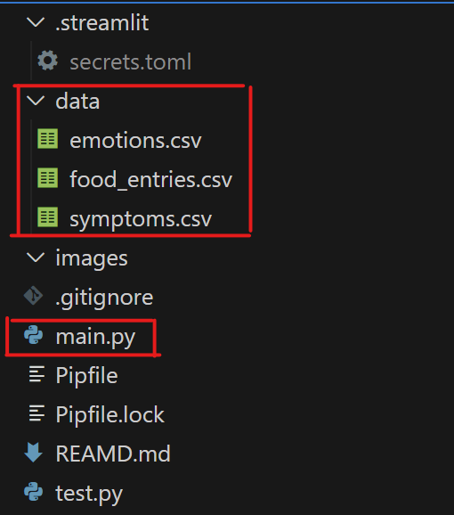
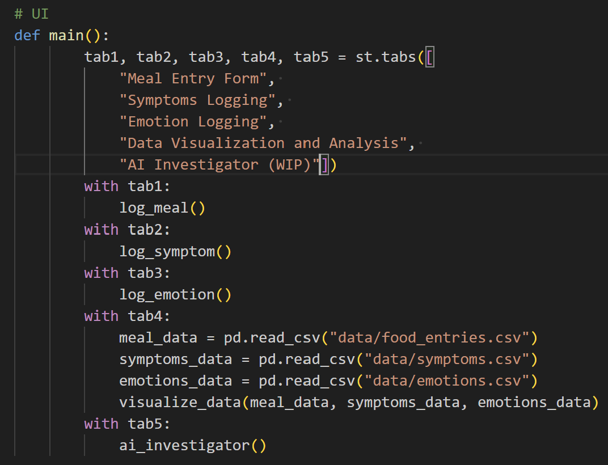

# NibbleNotes

# Overview
There are only 2 files worth looking at:
- main.py (this is the application that is running)
- the data/ folder and its csv files



There are 3 data sources in the data/ folder:  
1. emotions.csv
2. food_entries.csv
3. symptoms.csv

Each one is captured in the streamlit app on its respective tab.

You can see how the tabs are created below:


When each one is selected, that tab is now active and it will run the indented
code in the block.  
For example, when the ```python with tab1: ``` is selected, it will run the
function call which is named ```python log_meal()```